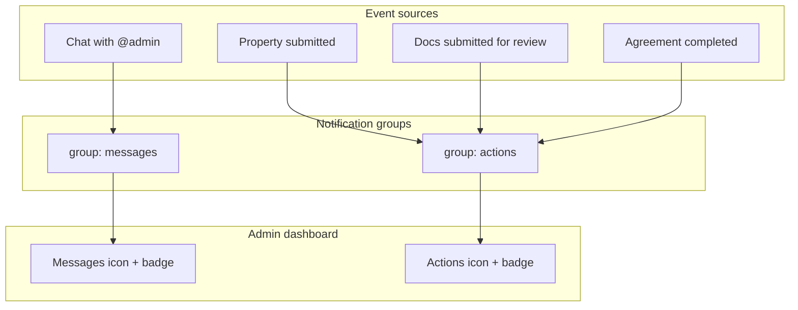

# Admin Notification Groups — Frontend Integration

Guide for the **Khayalami admin portal** (`khayamanage.co.zw`). Implements a Facebook-style split: one icon for **tagged message** notifications, another for **admin attention / actions**.

Related backend docs:

- [PORTAL_REALTIME_CHAT_NOTIFICATIONS.md](./PORTAL_REALTIME_CHAT_NOTIFICATIONS.md) — socket + chat basics
- This doc — **admin-only** two-group notification UX

---

## Why we are doing this

Previously, every public chat message created an in-app (and FCM) notification for **all** active admins. That flooded the admin bell and made real work (verify property, verify documents, signed agreements) hard to notice.

**Goals:**

1. **Messages group** — notify admins only when someone tags `@admin` in a chat message (like Messenger).
2. **Actions group** — notify admins when something needs staff attention (new listing, doc verification, completed agreement, etc.).
3. Keep everything **realtime** via the existing `notification_created` socket event.
4. Keep **live chat monitoring** separate: admins still receive Socket.IO `new_message` on `role:admin` for the chat inbox UI. That is **not** the same as the messages notification icon.



---

## Groups and types

| `group` | Meaning | Typical `type` values |
|---------|---------|------------------------|
| `messages` | Admin was tagged / chat notification | `new_message`, `viewing_request`, `move_in_request`, `viewing_response`, `move_in_response`, `chat` |
| `actions` | Work queue / attention needed | `property_submitted`, `document_verification_submitted`, `agreement_completed`, `system`, … |

Every notification document now includes a `group` field. Socket payloads include it too.

**Important:** Public (untagged) chat messages no longer create admin notifications. Admins only get a **messages**-group notification when content includes `@admin`.

---

## UI requirements

On the Khaya **admin** shell (header / sidebar):

1. **Messages icon** (chat/messenger style)
   - Badge = unread count for `group=messages`
   - Click → panel/list filtered to messages group
   - Item click → open chat (`data.chatId`), mark that notification read

2. **Actions icon** (bell / checklist style)
   - Badge = unread count for `group=actions`
   - Click → panel/list filtered to actions group
   - Item click → route by `type` / `data` (see deep links below)

Do **not** collapse both into a single bell anymore for admin. Landlord/tenant portals can keep a single inbox if desired (API remains backward compatible).

---

## REST API

Base path: `/api/notifications` (same auth JWT as today).

### List by group

```http
GET /api/notifications?group=messages&page=1&limit=20
GET /api/notifications?group=actions&page=1&limit=20&unreadOnly=true
```

Response `data.items[]` each include `group`, `type`, `title`, `body`, `data`, `read`, `createdAt`.

Invalid `group` → `400` with message `Invalid group. Use messages or actions.`

### Unread counts (dual badges)

```http
GET /api/notifications/unread-count
```

```json
{
  "success": true,
  "data": {
    "unreadCount": 5,
    "byGroup": {
      "messages": 2,
      "actions": 3
    }
  }
}
```

- `unreadCount` — total (backward compatible)
- `byGroup.messages` / `byGroup.actions` — drive the two badges

### Mark one read

```http
PUT /api/notifications/:id/read
```

### Mark all read (optionally per group)

```http
PUT /api/notifications/read-all
PUT /api/notifications/read-all?group=messages
PUT /api/notifications/read-all?group=actions
```

Omit `group` to clear both. Prefer per-group clear so “mark messages read” does not wipe action badges.

---

## Realtime (Socket.IO)

Connect with JWT as documented in the portal realtime guide. Admins auto-join `user:{id}` and `role:admin`.

### Event: `notification_created`

```javascript
socketService.on('notification_created', ({ notification }) => {
  // notification.group === 'messages' | 'actions'
  notificationStore.addNotification(notification);
});
```

Payload shape (relevant fields):

```json
{
  "notification": {
    "_id": "...",
    "userId": "...",
    "type": "document_verification_submitted",
    "group": "actions",
    "title": "Document verification pending",
    "body": "Jane Doe (landlord) submitted documents for review",
    "data": { "userId": "...", "role": "landlord", "path": "/admin/verifications" },
    "read": false,
    "createdAt": "..."
  }
}
```

Chat-originated payloads may also include `suppressBanner` (true when the admin is already viewing that chat room).

### Handler logic for badges

```javascript
function onNotificationCreated(notification) {
  if (notificationStore.has(notification._id)) return;

  notificationStore.prepend(notification);

  const group = notification.group || inferGroupFromType(notification.type);
  if (notification.read) return;

  // Optional: skip badge bump for chat banners when already in that thread
  if (group === 'messages' && notification.suppressBanner) return;

  if (group === 'messages') {
    notificationStore.unreadByGroup.messages += 1;
  } else {
    notificationStore.unreadByGroup.actions += 1;
  }
  notificationStore.unreadCount =
    notificationStore.unreadByGroup.messages +
    notificationStore.unreadByGroup.actions;
}
```

Also listen to legacy `chat_notification` if your portal still registers it — same `notification` object, now with `group`.

### Separate: live chat monitoring

```javascript
socketService.on('new_message', ({ chatId, message }) => {
  // Update admin chat list / open thread — NOT the messages-notification badge
  adminChatStore.handleNewMessage(chatId, message);
});
```

Do **not** increment the messages-notification badge from `new_message`. Only `notification_created` with `group: "messages"` should do that (i.e. `@admin` tags).

---

## Suggested Pinia / Vuex store shape

```javascript
// notificationStore.js (admin)
state: () => ({
  messages: [],      // list for messages panel
  actions: [],       // list for actions panel
  unreadByGroup: { messages: 0, actions: 0 },
  unreadCount: 0,
}),

actions: {
  async fetchUnreadCount() {
    const { data } = await api.get('/notifications/unread-count');
    this.unreadCount = data.unreadCount;
    this.unreadByGroup = data.byGroup;
  },

  async fetchGroup(group, { page = 1, unreadOnly = false } = {}) {
    const { data } = await api.get('/notifications', {
      params: { group, page, limit: 20, unreadOnly },
    });
    if (group === 'messages') this.messages = data.items;
    else this.actions = data.items;
  },

  async markRead(id) {
    await api.put(`/notifications/${id}/read`);
    // decrement matching group badge locally or refetch unread-count
    await this.fetchUnreadCount();
  },

  async markGroupRead(group) {
    await api.put('/notifications/read-all', null, { params: { group } });
    await this.fetchUnreadCount();
    await this.fetchGroup(group);
  },
}
```

On admin app bootstrap (after login): `fetchUnreadCount()` + register socket listeners once.

---

## Deep links by action type

| `type` | Suggested route | Key `data` fields |
|--------|-----------------|-------------------|
| `new_message` (and other chat types) | `/admin/chat/:chatId` (join first if needed) | `chatId`, `messageId`, `landlordId` |
| `property_submitted` | `/admin/properties/:propertyId` or verification queue | `propertyId` |
| `document_verification_submitted` | `/admin/verifications` (or user detail) | `userId`, `role`, `path` |
| `agreement_completed` | `/admin/agreements/:agreementId` if present | `agreementId`, etc. |

Always mark the notification read after successful navigation.

---

## Testing checklist (admin portal)

- [ ] Untagged public chat message → **no** messages-badge increase; chat list may still update via `new_message`
- [ ] Message containing `@admin` → messages badge +1; item appears under messages panel in realtime
- [ ] Landlord publishes unverified listing → actions badge +1 (`property_submitted`)
- [ ] Landlord/tenant submits docs for review → actions badge +1 (`document_verification_submitted`)
- [ ] Both parties complete agreement → actions badge +1 (`agreement_completed`)
- [ ] `GET /unread-count` returns correct `byGroup` split
- [ ] Mark-all-read `?group=messages` clears only messages badge
- [ ] Opening a tagged chat clears related chat notifications (existing sync) without wiping actions

---

## Migration note for existing data

Older notification rows may lack `group`. The API list/count endpoints map them by `type` (chat types → messages, else → actions). New writes always persist `group`. Frontend should still prefer `notification.group` when present.
