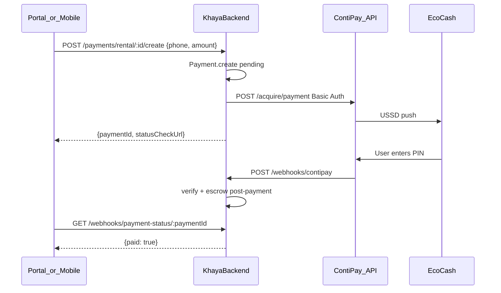

# ContiPay Payment Gateway Integration

Khayalami uses **ContiPay** (default) for online EcoCash payments. PayNow remains available for rollback via `PAYMENT_GATEWAY=paynow`.

---

## Architecture



---

## Environment variables

Add to `.env` on the backend server:

```env
# Active gateway: contipay (default) or paynow
PAYMENT_GATEWAY=contipay

# ContiPay credentials
CONTIPAY_ENVIRONMENT=dev
CONTIPAY_API_USER=your_api_user
CONTIPAY_API_SECRET=your_api_secret
CONTIPAY_MERCHANT_ID=871
CONTIPAY_CURRENCY=USD

# Callback URLs (production example)
CONTIPAY_WEBHOOK_URL=https://khayamanage.co.zw/api/backend/webhooks/contipay
CONTIPAY_SUCCESS_URL=https://khayamanage.co.zw/payment/success
CONTIPAY_CANCEL_URL=https://khayamanage.co.zw/payment/cancel

# Optional overrides
CONTIPAY_DEV_BASE_URL=https://api2-test.contipay.co.zw
CONTIPAY_LIVE_BASE_URL=https://api-v2.contipay.co.zw
CONTIPAY_PAYMENT_EXPIRY_MINUTES=15
```

| Variable | Description |
|----------|-------------|
| `CONTIPAY_ENVIRONMENT` | `dev` (test) or `live` |
| `CONTIPAY_API_USER` | API User / token (HTTP Basic username) |
| `CONTIPAY_API_SECRET` | API secret (HTTP Basic password) |
| `CONTIPAY_MERCHANT_ID` | Merchant ID from ContiPay dashboard |
| `CONTIPAY_WEBHOOK_URL` | Server-to-server callback URL |

---

## ContiPay API (Acquire — EcoCash direct)

| Item | Value |
|------|-------|
| Dev base URL | `https://api2-test.contipay.co.zw` |
| Live base URL | `https://api-v2.contipay.co.zw` |
| Endpoint | `POST /acquire/payment` |
| Auth | HTTP Basic (`API_USER` / `API_SECRET`) |
| Provider | EcoCash — code `EC` |
| Currency | USD |

---

## Backend files

| File | Purpose |
|------|---------|
| `src/config/contipayConfig.ts` | ContiPay env configuration |
| `src/config/paymentGatewayConfig.ts` | `PAYMENT_GATEWAY` switch |
| `src/services/ContipayService.ts` | Initiate, webhook, status poll |
| `src/services/PaymentGatewayService.ts` | Unified facade for controllers |
| `src/services/PaymentCompletionService.ts` | Escrow/subscription post-payment |
| `src/routes/webhookRoutes.ts` | `/webhooks/contipay` + status poll |

---

## Endpoints that support ContiPay

All online payments require **`phone`** (EcoCash number). Send `paymentMethod: "contipay"` or omit (phone alone triggers gateway).

| Endpoint | Purpose |
|----------|---------|
| `POST /api/payments/rental/:rentalId/create` | Rent |
| `POST /api/tenant/subscription/subscribe` | Tenant subscription |
| `POST /api/landlord/subscription/subscribe` | Landlord premium |
| `POST /api/landlord/subscription/zero-deposit-protection` | Zero deposit |
| `POST /api/properties/:propertyId/boost` | Premium boost |
| `POST /api/agreements/:id/pay-fee` | Agreement fee |

### Example: initiate rent payment

```http
POST /api/payments/rental/:rentalId/create
Authorization: Bearer <token>
Content-Type: application/json

{
  "amount": 500,
  "paymentMethod": "contipay",
  "paymentType": "rent",
  "phone": "0771234567"
}
```

### Success response `201`

```json
{
  "success": true,
  "message": "Payment initiated. Check your phone for EcoCash payment instructions.",
  "data": {
    "paymentId": "...",
    "reference": "RENT-userId-1234567890",
    "pollUrl": null,
    "instructions": "Please check your phone for the EcoCash payment prompt...",
    "statusCheckUrl": "/api/webhooks/payment-status/...",
    "gateway": "contipay"
  }
}
```

---

## Webhook

```
POST /api/webhooks/contipay
```

No authentication. ContiPay sends payment status updates here.

**Production URL:** `https://khayamanage.co.zw/api/backend/webhooks/contipay`

Health check:

```
GET /api/webhooks/contipay
```

Webhook payload fields are logged on first receipt. Status is matched from common fields: `status`, `transactionStatus`, `paymentStatus`, `transaction.status`.

Paid statuses: `paid`, `success`, `successful`, `completed`, `approved`, `ok`.

---

## Frontend polling

Poll until `paid: true`:

```
GET /api/webhooks/payment-status/:paymentId
Authorization: Bearer <token>
```

```json
{
  "success": true,
  "data": {
    "paid": true,
    "status": "completed",
    "payment": { ... },
    "gateway": "contipay"
  }
}
```

Poll every 3–5 seconds for up to 15 minutes. Pending payments auto-expire after `CONTIPAY_PAYMENT_EXPIRY_MINUTES` (default 15).

---

## Logging

Filter server logs:

```
[ContiPay]
[PaymentCompletion]
```

---

## Rollback to PayNow

Set in `.env`:

```env
PAYMENT_GATEWAY=paynow
PAYNOW_INTEGRATION_ID=...
PAYNOW_INTEGRATION_KEY=...
PAYNOW_MERCHANT_EMAIL=...
```

Restart backend. Existing PayNow webhook at `/api/webhooks/paynow` remains active.

---

## Test plan

1. Set `CONTIPAY_ENVIRONMENT=dev` and test credentials
2. Initiate rent payment with test EcoCash number from ContiPay dashboard
3. Confirm USSD prompt on phone
4. Verify webhook hits `POST /api/webhooks/contipay` (check logs)
5. Poll `GET /api/webhooks/payment-status/:paymentId` → `paid: true`
6. Confirm escrow + invoice updated

---

## Removed: legacy mock payments

The `gatewayResponse` bypass (instant verify without real gateway) has been **removed** from online payment endpoints. All in-app payments now require a real EcoCash transaction via ContiPay.

---

## Related docs

- [TENANT_RENT_PAYMENT_FRONTEND_GUIDE.md](./TENANT_RENT_PAYMENT_FRONTEND_GUIDE.md) — frontend rent flow
- [PAYNOW_INTEGRATION.md](./PAYNOW_INTEGRATION.md) — legacy PayNow (rollback only)
