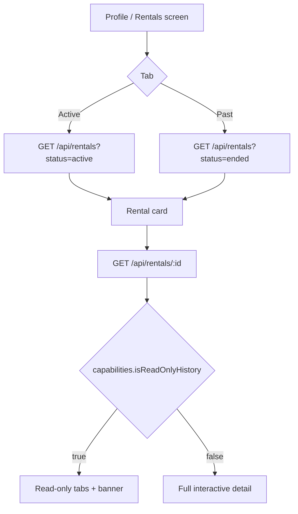

# Ended / Past Rentals — Frontend Implementation Guide

This document tells the **portal frontend team** how to show **past (terminated) rentals** on landlord and tenant profiles, keep **full read-only history** (payments, services, maintenance, condition logs), and **disable all payment / new-service actions** when a rental is no longer active.

**Applies to:** Khayalami web portal and mobile app (same APIs).

---

## Who implements what

| What | Portal / role | New UI? | Priority |
|------|----------------|---------|----------|
| **Past rentals list** on profile / rentals screen | **Tenant + Landlord** | Extend existing rentals section (tabs or filter) | High |
| **“No longer active” badge** on rental cards | **Tenant + Landlord** | Badge/chip on card + detail header | High |
| **Rental detail — read-only history** | **Tenant + Landlord** | Same detail page; hide/disable action buttons | High |
| **Disable rent payment forms** | **Tenant** | Grey out pay buttons, EcoCash, proof upload | High |
| **Disable service / maintenance request forms** | **Tenant** | Grey out “Request service”, “Report issue”, condition log upload | High |
| **Landlord earnings from past rental** | **Landlord** | Show in rental detail + dashboard past list (read-only) | Medium |

---

## Background — why we are doing this

When a tenancy **ends** (agreement terminated by mutual confirmation):

1. The **Rental** record moves to `status: "ended"`.
2. The **Property** moves to `status: "inactive"` (off tenant search; landlord can republish later).
3. Previously, ended rentals could **disappear** from profile views (dashboard only showed `active` rentals), or the UI still showed **“Pay rent”** and service forms as if the tenancy were ongoing.

**Goal:** Users must still see **their rental history** — what they paid, services booked, maintenance raised, condition logs — but **cannot start new financial or operational actions** on that rental.

---

## Rental lifecycle (relevant states)

| `Rental.status` | UI label (`statusLabel`) | Meaning |
|-----------------|--------------------------|---------|
| `active` | **Active** | Normal tenancy; all actions allowed |
| `ended` | **No longer active** | Contract terminated; read-only history |
| `suspended` | **Suspended** | Paused tenancy; same read-only rules as ended |

Termination flow (existing, no frontend change):

1. Either party on an **active** agreement: `POST /api/agreements/:id/request-termination`
2. Other party confirms: `POST /api/agreements/:id/confirm-termination`
3. Backend sets agreement → `terminated`, rental → `ended`, property → `inactive`

---

## User stories

### Tenant

| ID | Story | Acceptance |
|----|--------|------------|
| T1 | As a **tenant**, I want to see **past rentals** on my profile so I can review my tenancy history. | Profile / “My rentals” lists ended rentals with a **“No longer active”** badge. |
| T2 | As a **tenant**, I want to open a past rental and see **payments, breakdown, services, and maintenance** without losing data. | Detail page loads history via existing GET endpoints; no empty state if rental is ended. |
| T3 | As a **tenant**, I must **not pay rent** on an ended rental. | Pay-rent buttons, EcoCash flow, and proof upload are **disabled**; API returns 400 if attempted. |
| T4 | As a **tenant**, I must **not request new services or maintenance** on an ended rental. | Request forms disabled; tooltips explain why. |
| T5 | As a **tenant**, I want a clear banner on ended rental detail: *“This rental is no longer active. You cannot pay rent or request new services.”* | Banner visible when `capabilities.isReadOnlyHistory === true`. |

### Landlord

| ID | Story | Acceptance |
|----|--------|------------|
| L1 | As a **landlord**, I want to see **past rentals** and **earnings from that tenancy** on my profile. | Past rentals list + payment summary on detail; verified totals shown. |
| L2 | As a **landlord**, I want the same **“No longer active”** label so I know the tenancy ended. | Badge on card and detail header. |
| L3 | As a **landlord**, I can **view** payment history and activity but **not** expect new tenant payments. | Read-only view; no “request payment” nudges for ended rentals. |

---

## Capability flags (single source of truth for UI)

Every enriched rental object (list, dashboard, detail) includes these fields. **Use them to enable/disable UI** — do not infer from `status` string alone in multiple places.

```json
{
  "status": "ended",
  "statusLabel": "No longer active",
  "isActive": false,
  "isEnded": true,
  "isSuspended": false,
  "canPayRent": false,
  "canBookServices": false,
  "canRequestMaintenance": false,
  "canUploadConditionLogs": false,
  "isReadOnlyHistory": true,
  "endedAt": "2026-05-15T10:00:00.000Z",
  "statusSubtitle": "Ended 5/15/2026",
  "agreementStatus": "terminated",
  "terminatedAt": "2026-05-15T10:00:00.000Z"
}
```

### UI disable matrix

| UI element | Enable when |
|------------|-------------|
| Pay rent / EcoCash / bank transfer proof | `canPayRent === true` |
| Book service (`POST /api/services/book`) | `canBookServices === true` |
| Request maintenance | `canRequestMaintenance === true` |
| Upload condition log | `canUploadConditionLogs === true` |
| View payment list, invoices, maintenance list, service list | **Always** (read-only) |
| Landlord verify/reject **existing** pending payment | Allowed (legacy edge case); prefer read-only banner on ended rental |

**Recommended helper (frontend):**

```typescript
function isRentalOperational(rental: RentalWithCapabilities): boolean {
  return rental.canPayRent === true;
}
```

---

## API endpoints

All routes require `Authorization: Bearer <token>`.

### 1. List rentals (active + past)

```
GET /api/rentals
GET /api/rentals?status=all       ← default behaviour (all statuses)
GET /api/rentals?status=active
GET /api/rentals?status=ended
GET /api/rentals?status=suspended
```

**Role:** Tenant sees their tenancies; landlord sees their landlord-side rentals.

**Response:**

```json
{
  "success": true,
  "data": [
    {
      "_id": "...",
      "status": "ended",
      "statusLabel": "No longer active",
      "isReadOnlyHistory": true,
      "canPayRent": false,
      "propertyId": { "title": "...", "address": "..." },
      "monthlyRent": 500,
      "startDate": "...",
      "endDate": "...",
      "endedAt": "...",
      "agreementStatus": "terminated"
    }
  ]
}
```

**Frontend:** Split into tabs **Active** / **Past** using client-side filter on `status`, or fetch `?status=active` and `?status=ended` separately.

---

### 2. Rental detail dashboard (history hub)

```
GET /api/rentals/:id
```

**Response (key fields):**

```json
{
  "success": true,
  "data": {
    "rental": {
      "_id": "...",
      "status": "ended",
      "statusLabel": "No longer active",
      "isReadOnlyHistory": true,
      "canPayRent": false,
      "propertyId": { ... },
      "landlordId": { ... },
      "tenantId": { ... }
    },
    "capabilities": {
      "statusLabel": "No longer active",
      "isActive": false,
      "isEnded": true,
      "canPayRent": false,
      "canBookServices": false,
      "canRequestMaintenance": false,
      "canUploadConditionLogs": false,
      "isReadOnlyHistory": true
    },
    "payments": [ ... ],
    "conditionLogs": [ ... ],
    "paymentSummary": {
      "totalVerifiedAmount": 4500,
      "verifiedCount": 9,
      "pendingCount": 0,
      "totalCount": 9
    },
    "nextAction": {
      "type": "rental_ended",
      "message": "No longer active",
      "dueDate": "2026-05-15T10:00:00.000Z"
    }
  }
}
```

**`nextAction.type` values:**

| type | When | UI |
|------|------|-----|
| `rental_ended` | `status` is `ended` or `suspended` | Show info banner; **no** pay CTA |
| `payment_overdue` | Active rental only | Existing pay flow |
| `payment_due_soon` | Active rental only | Existing reminder |
| `condition_log_*` | Active rental only | Existing upload CTA |

---

### 3. Sub-resources (read-only on ended rentals)

These **GET** endpoints still work for ended rentals:

| Resource | Endpoint |
|----------|----------|
| Payments | `GET /api/rentals/:rentalId/payments` |
| Payment stats | `GET /api/rentals/:rentalId/payments/stats` |
| Condition logs | `GET /api/rentals/:rentalId/condition-logs` |
| Maintenance | `GET /api/rentals/:rentalId/maintenance` |
| Services | `GET /api/rentals/:rentalId/services` |
| Services (alt) | `GET /api/services/rental/:rentalId` |

Use **`paymentSummary`** from the dashboard response for the header totals; use the payments list for line-item breakdown (including `metadata` for agreement-fee-on-first-rent bundles).

---

### 4. Blocked mutations (return HTTP 400)

Backend rejects new tenant actions on non-active rentals with:

> `"This rental is no longer active. Rent payments and new service requests are disabled."`  
> or  
> `"This rental is no longer active. You cannot request new services or maintenance."`

| Action | Method | Endpoint |
|--------|--------|----------|
| Pay rent (online / in-app) | POST | `/api/payments/rental/:rentalId/create` |
| Pay rent (external proof) | POST | `/api/payments/rental/:rentalId/create` (body `paymentMethod` ≠ `in_app`) |
| Submit payment proof | POST | `/api/payments/:paymentId/submit` |
| Submit payment proof (rental route) | POST | `/api/rentals/payments/:paymentId/submit` |
| Book service | POST | `/api/services/book` |
| Book service (rental route) | POST | `/api/rentals/:rentalId/services` |
| Request maintenance | POST | `/api/rentals/:rentalId/maintenance` |
| Upload condition log | POST | `/api/rentals/:rentalId/condition-logs` |

**Frontend:** Disable buttons **before** calling API; still handle 400 gracefully (toast with server message).

---

### 5. Tenant dashboard (profile shortcut)

```
GET /api/tenant/dashboard
```

**New field:**

```json
{
  "rental": { ... },          // current active rental only, or null
  "pastRentals": [ ... ],     // ended/suspended, enriched with capability flags
  "payments": { ... },
  ...
}
```

Use `pastRentals` for a **“Past tenancies”** section on the tenant home/profile without an extra list call.

---

### 6. Landlord dashboard (profile shortcut)

```
GET /api/landlord/dashboard
```

**New / extended fields:**

```json
{
  "properties": {
    "total": 5,
    "activeRentals": 2,
    "pastRentals": 3,
    "totalAgreements": 8
  },
  "recentActivity": {
    "activeRentals": [ ... ],
    "pastRentals": [ ... ],
    "recentPayments": [ ... ]
  }
}
```

Use `recentActivity.pastRentals` for a compact “Past rentals” strip; link each card to `GET /api/rentals/:id`.

---

## Screens to implement / update

### Tenant — “My rentals”

1. **Tabs:** `Active` | `Past` (or single list with section headers).
2. **Card layout:** Property image, title, monthly rent, dates, **`statusLabel` badge** (grey for past).
3. **Tap card** → rental detail (same route as active; pass rental id).

### Tenant — Rental detail (ended)

```
┌─────────────────────────────────────────────┐
│  [Property photo]                           │
│  12 Main Street          [No longer active] │
│  May 2024 – May 2026                        │
├─────────────────────────────────────────────┤
│  ⓘ This rental is no longer active.        │
│    You cannot pay rent or request services. │
├─────────────────────────────────────────────┤
│  Payments    │  Services  │  Maintenance   │
│  (read-only tables / existing components)   │
└─────────────────────────────────────────────┘
```

- Hide or disable: **Pay rent**, **EcoCash**, **Upload proof**, **Book service**, **Report issue**, **Upload condition video**.
- Show: payment history, `paymentSummary.totalVerifiedAmount`, service/maintenance history.

### Landlord — Rentals / profile

Same pattern as tenant:

- **Active rentals** — existing dashboard widgets unchanged.
- **Past rentals** — new section from `pastRentals` or `GET /api/rentals?status=ended`.
- Detail page: show **total verified earnings** for that tenancy (`paymentSummary`); no prompts to collect new rent.

---

## Suggested frontend data flow



---

## Edge cases

| Case | Behaviour |
|------|-----------|
| Tenant has **no** active rental | `GET /api/tenant/dashboard` → `rental: null`; show past rentals only |
| Rental `suspended` | Same UI as ended (`isReadOnlyHistory: true`, label **Suspended**) |
| Pending payments left after termination | Shown in history; tenant **cannot** submit new proof; landlord may still verify existing (rare) |
| Property republished after end | New tenancy = **new** rental record; old ended rental stays in Past tab |

---

## Testing checklist

### Tenant

- [ ] End a tenancy via termination flow; rental appears under **Past** with badge **No longer active**
- [ ] Open past rental detail; payments and services lists load
- [ ] Pay rent button disabled; direct API POST returns 400
- [ ] Service book + maintenance create disabled; API returns 400
- [ ] Active rental unchanged — all actions still work

### Landlord

- [ ] Past rental visible on dashboard `recentActivity.pastRentals`
- [ ] Rental detail shows `paymentSummary.totalVerifiedAmount`
- [ ] No “collect rent” CTA on ended rental detail

---

## Related docs

- Agreement termination (existing): agreement routes under `/api/agreements`
- Property republish after end: `PUT /api/properties/:id/status` with `{ "status": "published" }`
- Connection / rental requests: [TENANT_RENTAL_REQUESTS_FRONTEND.md](./TENANT_RENTAL_REQUESTS_FRONTEND.md)

---

## Summary for frontend agent

1. **Show ended rentals** — do not hide them; badge = **`statusLabel`** (`"No longer active"`).
2. **Drive all disable logic from capability flags** on the rental object (`canPayRent`, `canBookServices`, etc.).
3. **Primary APIs:** `GET /api/rentals`, `GET /api/rentals/:id`, plus dashboard `pastRentals` on tenant/landlord home.
4. **Block mutations in UI** for ended/suspended rentals; backend enforces with 400 if bypassed.
5. **History stays readable** — all GET sub-resources work; use `paymentSummary` for headline totals.
