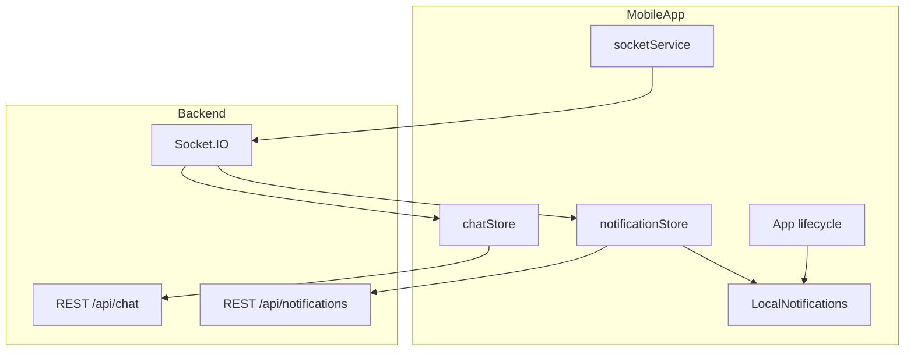

# Mobile Real-Time Chat and Notifications (Vue + Capacitor)

Implementation guide for the **Khayalami mobile app** (Vue.js + Capacitor). Tenant and landlord use the **same code path**; role comes from the JWT after login.

**Unread message counts (landlord/tenant bug fix):** If one party opening a chat clears the other party’s unread badge, read [MOBILE_CHAT_UNREAD_AND_READ_RECEIPTS.md](./MOBILE_CHAT_UNREAD_AND_READ_RECEIPTS.md) — that is a **mobile app** fix, not the admin portal.

---

## Production endpoints

```env
VITE_API_URL=http://31.220.82.129:4002/api
VITE_SOCKET_URL=http://31.220.82.129:4002
```

| Service | URL |
|---------|-----|
| REST API | `http://31.220.82.129:4002/api` |
| Socket.IO | `http://31.220.82.129:4002` |

---

## Scope (this phase)

| Supported | Not supported (this phase) |
|-----------|----------------------------|
| Real-time messages while app is open | Push when app is **force-killed** |
| Socket while app is backgrounded (best effort) | Firebase / third-party push |
| In-app notification inbox + badge | |
| Capacitor **local notifications** when app is backgrounded | |

On cold start after force-kill: sync unread via `GET /api/notifications/unread-count` and `GET /api/chat`.

---

## Install

```bash
npm install socket.io-client
npm install @capacitor/app @capacitor/local-notifications
npx cap sync
```

---

## Capacitor permissions

### Android (`AndroidManifest.xml`)

```xml
<uses-permission android:name="android.permission.INTERNET" />
<uses-permission android:name="android.permission.POST_NOTIFICATIONS" />
```

### iOS

Request notification permission on first chat use (see below).

### `capacitor.config.ts`

```typescript
import { CapacitorConfig } from '@capacitor/cli';

const config: CapacitorConfig = {
  appId: 'com.khayalami.app',
  appName: 'Khayalami',
  webDir: 'dist',
  server: {
    // For dev against production API:
    // cleartext: true,
  },
};

export default config;
```

Use env-based API URL in app code, not hardcoded in capacitor config for production builds.

---

## Architecture



---

## 1. Recommended folder structure

```
src/
  services/
    socketService.ts      # Socket.IO singleton
    notificationApi.ts    # REST wrapper for /api/notifications
    chatApi.ts            # REST wrapper for /api/chat
  stores/
    chatStore.ts          # Pinia
    notificationStore.ts  # Pinia
  composables/
    useChatRealtime.ts    # Wire socket + stores
    useAppNotifications.ts # Local notifications + app state
  views/
    ChatList.vue
    ChatThread.vue
    NotificationInbox.vue
```

---

## 2. Socket service

Same as portal — connect with JWT after login:

```typescript
import { io, Socket } from 'socket.io-client';

const SOCKET_URL = import.meta.env.VITE_SOCKET_URL || 'http://31.220.82.129:4002';

let socket: Socket | null = null;

export function connectSocket(token: string) {
  if (socket?.connected) return socket;

  socket = io(SOCKET_URL, {
    auth: { token },
    transports: ['websocket', 'polling'],
    reconnection: true,
  });

  return socket;
}

export function getSocket() {
  return socket;
}

export function disconnectSocket() {
  socket?.disconnect();
  socket = null;
}

export function joinChat(chatId: string) {
  socket?.emit('join_chat', chatId);
}

export function leaveChat(chatId: string) {
  socket?.emit('leave_chat', chatId);
}
```

**Mobile tip:** prefer `websocket` first; fall back to `polling` on poor networks.

---

## 3. App lifecycle + local notifications

`src/composables/useAppNotifications.ts`:

```typescript
import { App } from '@capacitor/app';
import { LocalNotifications } from '@capacitor/local-notifications';
import { ref } from 'vue';

export const allowLocalNotifications = ref(false);
export const activeChatId = ref<string | null>(null);

export async function initAppNotifications() {
  const perm = await LocalNotifications.requestPermissions();
  if (perm.display !== 'granted') return;

  App.addListener('appStateChange', ({ isActive }) => {
    allowLocalNotifications.value = !isActive;
    if (isActive) {
      LocalNotifications.removeAllDeliveredNotifications();
    }
  });

  LocalNotifications.addListener('localNotificationActionPerformed', (action) => {
    const chatId = action.notification.extra?.chatId;
    if (chatId) {
      // router.push(`/chat/${chatId}`)
    }
  });
}

export async function showChatLocalNotification(params: {
  id: number;
  title: string;
  body: string;
  chatId: string;
}) {
  if (!allowLocalNotifications.value) return;
  if (activeChatId.value === params.chatId) return;

  await LocalNotifications.schedule({
    notifications: [
      {
        id: params.id,
        title: params.title,
        body: params.body,
        extra: { chatId: params.chatId },
      },
    ],
  });
}
```

---

## 4. Wire real-time handlers

`src/composables/useChatRealtime.ts`:

```typescript
import { getSocket } from '@/services/socketService';
import { useChatStore } from '@/stores/chatStore';
import { useNotificationStore } from '@/stores/notificationStore';
import { showChatLocalNotification, activeChatId } from './useAppNotifications';

let wired = false;

export function setupChatRealtime(currentUserId: string) {
  if (wired) return;
  const socket = getSocket();
  if (!socket) return;

  const chatStore = useChatStore();
  const notificationStore = useNotificationStore();

  socket.on('new_message', ({ chatId, message }) => {
    chatStore.ingestMessage(chatId, message, currentUserId);

    const senderId = message.senderId?._id || message.senderId;
    if (senderId?.toString?.() === currentUserId) return;
    if (activeChatId.value === chatId) return;

    showChatLocalNotification({
      id: Date.now() % 2147483647,
      title: 'New message',
      body: message.content?.substring(0, 100) || 'You have a new message',
      chatId,
    });
  });

  socket.on('notification_created', ({ notification }) => {
    notificationStore.add(notification);
    if (notification.data?.suppressBanner) return;
    if (activeChatId.value === notification.data?.chatId) return;

    showChatLocalNotification({
      id: Date.now() % 2147483647,
      title: notification.title,
      body: notification.body,
      chatId: notification.data?.chatId || '',
    });
  });

  socket.on('user_typing', (payload) => {
    chatStore.setTyping(payload);
  });

  socket.on('messages_read', (payload) => {
    // When admin sends from portal and tenant reads on mobile, landlord still has unread.
    // Do NOT clear landlord unread when payload.readBy is the tenant's ID.
    chatStore.applyReadReceipt(payload);
    if (payload.readBy?.toString() === currentUserId) {
      chatStore.setChatUnread(payload.chatId, 0);
    }
  });

  wired = true;
}
```

---

## 5. Chat thread screen

```typescript
// ChatThread.vue — script setup outline
import { onMounted, onUnmounted, watch } from 'vue';
import { joinChat, leaveChat } from '@/services/socketService';
import { activeChatId } from '@/composables/useAppNotifications';

const props = defineProps<{ chatId: string }>();

onMounted(async () => {
  activeChatId.value = props.chatId;
  joinChat(props.chatId);
  await chatStore.loadChat(props.chatId); // GET /api/chat/:chatId
});

onUnmounted(() => {
  leaveChat(props.chatId);
  if (activeChatId.value === props.chatId) {
    activeChatId.value = null;
  }
});

async function send(content: string) {
  await chatApi.sendMessage(props.chatId, { content });
  // Optimistic UI optional; server response + socket both deliver final message
}
```

---

## 6. REST API reference (mobile)

### Chat

| Action | Method | Path |
|--------|--------|------|
| List chats | GET | `/api/chat` — each chat has `unreadCount` **for you** |
| Open chat | GET | `/api/chat/:chatId` — marks read **for you only**; `message.isRead` is per-user |
| Mark chat read | PUT | `/api/chat/:chatId/read` — optional; marks read **for you only** |
| Send message | POST | `/api/chat/:chatId/messages` |
| Unread stats | GET | `/api/chat/unread-count` |
| Get/create chat | POST | `/api/chat/get-or-create` |

Body for send:

```json
{ "content": "Hello", "messageType": "text" }
```

### Tenant-only

| Action | Method | Path |
|--------|--------|------|
| Viewing request | POST | `/api/chat/viewing-request` |
| Move-in request | POST | `/api/chat/move-in-request` |
| Pending requests | GET | `/api/chat/pending-requests` |

### Landlord-only

| Action | Method | Path |
|--------|--------|------|
| Viewing inbox | GET | `/api/chat/viewing-requests` |
| Respond viewing | PUT | `/api/chat/viewing-request/respond` |
| Move-in inbox | GET | `/api/chat/move-in-requests` |
| Respond move-in | PUT | `/api/chat/move-in-request/respond` |

### Notifications

| Action | Method | Path |
|--------|--------|------|
| Inbox | GET | `/api/notifications?page=1&limit=20` |
| Badge count | GET | `/api/notifications/unread-count` |
| Mark one read | PUT | `/api/notifications/:id/read` |
| Mark all read | PUT | `/api/notifications/read-all` |

All requests: `Authorization: Bearer <token>`.

---

## 7. Cold start sync

On app launch (after auth):

```typescript
async function syncOnLaunch() {
  connectSocket(token);
  setupChatRealtime(userId);
  await Promise.all([
    chatStore.loadChats(),
    notificationStore.fetchUnreadCount(),
    notificationStore.fetchPage(1),
  ]);
}
```

---

## 8. Tenant vs landlord

No separate socket implementation. Branch UI only:

```typescript
const role = authStore.user.role; // 'tenant' | 'landlord'

const canSendViewingRequest = role === 'tenant';
const canRespondViewing = role === 'landlord';
```

---

## 9. Background limitations

| Scenario | Expected behaviour |
|----------|-------------------|
| App foreground, chat open | Instant messages, no local notification banner |
| App foreground, other screen | `new_message` updates list; optional in-app toast |
| App background, socket alive | Local notification via Capacitor |
| App force-killed | No notification until next open; then unread badge from REST |
| iOS low memory | OS may suspend JS; socket may drop — reconnect on `appStateChange` active |

Recommend keeping socket connected in background where OS allows; reconnect on `App.addListener('appStateChange')`.

---

## 10. Testing checklist

- [ ] Login → socket connects (check network tab / logs)
- [ ] Admin sends from portal → tenant and landlord each see separate unread counts on mobile
- [ ] Tenant opens chat on mobile → landlord unread **unchanged** until landlord opens
- [ ] Tenant sends message → landlord device updates without refresh
- [ ] Background landlord app → local notification appears
- [ ] Tap notification → opens correct chat thread
- [ ] Notification inbox shows entries from `GET /api/notifications`
- [ ] Badge matches `GET /api/notifications/unread-count`
- [ ] Force-kill app → reopen → unread count restored from API
- [ ] Viewing / move-in request flows still work

---

## 11. Troubleshooting

| Issue | Fix |
|-------|-----|
| Socket connect_error | Verify API URL reachable from device; Android cleartext if using HTTP |
| No local notification | Check permission; `allowLocalNotifications` true when backgrounded |
| Duplicate messages | Dedupe by `_id` in `chatStore.ingestMessage` |
| CORS / socket blocked | Set `SOCKET_CORS_ORIGINS` on server to include app origin |
| HTTP works, socket fails | Same host:4002; nginx must proxy `/socket.io/` WebSocket upgrade |

---

## Related docs

- [PORTAL_REALTIME_CHAT_NOTIFICATIONS.md](./PORTAL_REALTIME_CHAT_NOTIFICATIONS.md) — web portal (same socket contract)
- [REALTIME_CHAT_FRONTEND_GUIDE.md](./REALTIME_CHAT_FRONTEND_GUIDE.md)
- [PRODUCTION_WEBSOCKET_DEPLOYMENT.md](./PRODUCTION_WEBSOCKET_DEPLOYMENT.md) — nginx / Ubuntu deploy
