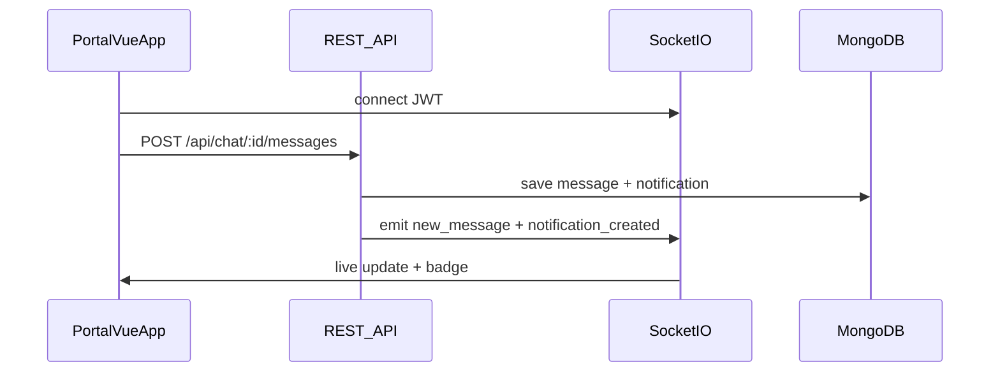

# Portal Real-Time Chat and Notifications

Implementation guide for the **Khayalami web portal** (landlord, tenant, and admin). Builds on the existing REST chat API and adds Socket.IO for live messages plus a self-hosted in-app notification inbox.

**Troubleshooting / QA:** If messages or notifications only appear after refresh, use [PORTAL_REALTIME_UI_VERIFICATION.md](./PORTAL_REALTIME_UI_VERIFICATION.md) — step-by-step checks for portal socket listeners, stores, and API URLs.

---

## Production endpoints

**Portal on `https://khayamanage.co.zw` (nginx proxy — recommended):**

```env
VITE_API_URL=https://khayamanage.co.zw/api/backend
VITE_SOCKET_URL=https://khayamanage.co.zw
```

| Service | URL |
|---------|-----|
| REST API | `https://khayamanage.co.zw/api/backend` |
| Socket.IO | `https://khayamanage.co.zw` (path `/socket.io/`, **not** under `/api/backend`) |
| Health | `GET https://khayamanage.co.zw/api/backend/health` |

Nginx config: [`deploy/nginx-khayamanage-portal.conf`](../deploy/nginx-khayamanage-portal.conf) — must include **both** `/api/backend/` and `/socket.io/` proxy blocks.

**Direct to backend (dev / no portal proxy):**

```env
VITE_API_URL=http://31.220.82.129:4002/api
VITE_SOCKET_URL=http://31.220.82.129:4002
```

Socket CORS for `https://khayamanage.co.zw` is hardcoded in `src/utils/socketCors.ts` — no server env needed.

---

## Architecture



**Rule:** HTTP remains the source of truth for sending. Socket delivers updates to other clients.

---

## Install

```bash
npm install socket.io-client
```

---

## 1. Socket singleton

Create `src/services/socketService.js` (or `.ts`):

```javascript
import { io } from 'socket.io-client';

class SocketService {
  constructor() {
    this.socket = null;
    this.connected = false;
  }

  connect(token) {
    if (this.socket?.connected) return this.socket;

    const url = import.meta.env.VITE_SOCKET_URL || 'http://31.220.82.129:4002';

    this.socket = io(url, {
      auth: { token },
      transports: ['websocket', 'polling'],
      reconnection: true,
      reconnectionAttempts: 10,
      reconnectionDelay: 1000,
    });

    this.socket.on('connect', () => { this.connected = true; });
    this.socket.on('disconnect', () => { this.connected = false; });
    this.socket.on('connect_error', (err) => {
      console.error('Socket error:', err.message);
      this.connected = false;
    });

    return this.socket;
  }

  disconnect() {
    this.socket?.disconnect();
    this.socket = null;
    this.connected = false;
  }

  joinChat(chatId) {
    this.socket?.emit('join_chat', chatId);
  }

  leaveChat(chatId) {
    this.socket?.emit('leave_chat', chatId);
  }

  on(event, handler) {
    this.socket?.on(event, handler);
  }

  off(event, handler) {
    this.socket?.off(event, handler);
  }

  startTyping(chatId) {
    this.socket?.emit('typing_start', { chatId });
  }

  stopTyping(chatId) {
    this.socket?.emit('typing_stop', { chatId });
  }

  markRead(chatId, messageIds = []) {
    this.socket?.emit('mark_messages_read', { chatId, messageIds });
  }
}

export default new SocketService();
```

**When to connect:** immediately after successful login (store JWT in Pinia/auth store, then `socketService.connect(token)`).

**When to disconnect:** on logout.

---

## 2. Pinia chat store (outline)

`src/stores/chatStore.js`:

| State | Purpose |
|-------|---------|
| `chats` | List from `GET /api/chat` |
| `messagesByChatId` | Map chatId → message array |
| `activeChatId` | Currently open conversation |
| `typingByChatId` | Map chatId → userId typing |
| `unreadByChatId` | Local unread counters |

| Action | API / Socket |
|--------|----------------|
| `loadChats()` | `GET /api/chat` |
| `openChat(chatId)` | `join_chat`, `GET /api/chat/:chatId` |
| `sendMessage(chatId, content)` | `POST /api/chat/:chatId/messages` |
| `handleNewMessage(payload)` | Socket `new_message` handler |

### Socket listeners (register once after connect)

```javascript
socketService.on('new_message', ({ chatId, message }) => {
  chatStore.handleNewMessage(chatId, message);
});

socketService.on('notification_created', ({ notification }) => {
  notificationStore.addNotification(notification);
});

socketService.on('notifications_marked_read', ({ chatId, notificationIds, unreadCount }) => {
  notificationStore.markReadByChat(chatId, notificationIds);
  notificationStore.setUnreadCount(unreadCount);
});

socketService.on('chat_notification', (payload) => {
  // Legacy alias — same shape as notification_created
  notificationStore.addNotification(payload.notification);
});

socketService.on('user_typing', ({ chatId, userId, isTyping }) => {
  chatStore.setTyping(chatId, userId, isTyping);
});

socketService.on('messages_read', ({ chatId, messageIds, readBy }) => {
  chatStore.markMessagesRead(chatId, messageIds, readBy);
});

socketService.on('joined_chat', ({ chatId }) => {
  console.log('Joined chat room', chatId);
});

socketService.on('socket_error', ({ message, chatId }) => {
  console.error('Socket error', chatId, message);
});
```

### `handleNewMessage` logic

1. Append message to `messagesByChatId[chatId]` if not duplicate (check `_id`).
2. If `activeChatId !== chatId`, increment `unreadByChatId[chatId]`.
3. Update chat list preview (`lastMessage`, timestamp).
4. Do **not** append if message is from current user and already added from HTTP response.

---

## 3. Notification inbox store

`src/stores/notificationStore.js`:

| Action | Endpoint |
|--------|----------|
| `fetchNotifications()` | `GET /api/notifications?page=1&limit=20` |
| `fetchUnreadCount()` | `GET /api/notifications/unread-count` |
| `markRead(id)` | `PUT /api/notifications/:id/read` |
| `markAllRead()` | `PUT /api/notifications/read-all` |

On `notification_created`:

- Push to local list if not duplicate.
- Increment badge unless `notification.data.suppressBanner === true` (user is viewing that chat).
- Optionally show browser notification (see below).

---

## 4. Chat UI flow

### Chat list page

1. On mount: `loadChats()`, `fetchUnreadCount()`, ensure socket connected.
2. Show unread badge per chat + global notification bell count.
3. Poll fallback (optional): refresh chat list every 60s if socket disconnected.

### Chat detail page

1. `openChat(chatId)` → `socketService.joinChat(chatId)`.
2. `GET /api/chat/:chatId` → render messages (respect `isPrivate`, `visibleTo`).
3. Send: `POST /api/chat/:chatId/messages` with `{ content, messageType?, attachments? }`.
4. On unmount: `leaveChat(chatId)`.
5. Mark read: opening chat auto-marks via GET; optionally `PUT /api/chat/:chatId/read` or socket `mark_messages_read`.

### Typing indicator

- On input: debounce `startTyping` / `stopTyping` (300ms).
- Show indicator when `user_typing` received for active chat.

---

## 5. Landlord portal

Same socket + store code as tenant. Differences:

| Feature | Endpoint | Role |
|---------|----------|------|
| Viewing requests inbox | `GET /api/chat/viewing-requests` | landlord |
| Respond to viewing | `PUT /api/chat/viewing-request/respond` | landlord |
| Move-in requests | `GET /api/chat/move-in-requests` | landlord |
| Respond to move-in | `PUT /api/chat/move-in-request/respond` | landlord |

Real-time: viewing/move-in messages arrive via `new_message` like normal text.

---

## 6. Tenant portal

| Feature | Endpoint | Role |
|---------|----------|------|
| Send viewing request | `POST /api/chat/viewing-request` | tenant |
| Send move-in request | `POST /api/chat/move-in-request` | tenant |
| Pending requests | `GET /api/chat/pending-requests` | tenant |

---

## 7. Admin portal (Khayalami admin)

### Live updates (no refresh)

On socket connect, the backend automatically puts admins in the `role:admin` monitoring room. Every tenant/landlord message is pushed via `new_message` to that room — **the portal must register a global `new_message` listener** (app shell, not only inside the thread component) and update the admin chat list.

### Opening and sending

1. List chats: `GET /api/chat/admin/all-chats?page=1&limit=50`
2. Join (REST, adds admin as participant): `POST /api/chat/admin/join/:chatId`
3. Open chat: `join_chat` + `GET /api/chat/:chatId`
4. Send: `POST /api/chat/:chatId/messages` (role `admin` in JWT)
5. Private messages: use `@tenant` or `@landlord` in content

Admin sees **all** messages including private @mentions via live `new_message` (chat monitoring). In-app / FCM **notifications** are created for admins only when a message tags `@admin` — not for every public chat message. See [ADMIN_NOTIFICATION_GROUPS_FRONTEND.md](./ADMIN_NOTIFICATION_GROUPS_FRONTEND.md) for the two-group admin inbox (messages vs actions).

---

## 8. Browser notifications (optional)

When tab is in background:

```javascript
async function maybeShowBrowserNotification(notification) {
  if (!('Notification' in window)) return;
  if (Notification.permission === 'default') {
    await Notification.requestPermission();
  }
  if (Notification.permission !== 'granted') return;
  if (!document.hidden) return;
  if (notification.data?.suppressBanner) return;

  new Notification(notification.title, {
    body: notification.body,
    tag: notification.data?.chatId || notification._id,
  });
}
```

Call from `notification_created` handler.

---

## 9. Private @mention messages

- Messages with `@landlord`, `@tenant`, or `@admin` are private.
- Socket delivers to `user:{recipientId}` rooms only.
- REST `GET /api/chat/:chatId` filters by `visibleTo` for non-admin users.
- UI: show lock icon or “Private message” label when `isPrivate === true`.

---

## 10. Files to modify (portal repo)

| Area | Files |
|------|-------|
| Auth bootstrap | Login success handler → connect socket |
| Chat | Chat list, chat thread, message input components |
| Notifications | Bell icon, dropdown inbox, badge |
| Admin | Admin chat list, join-before-open flow |
| Env | `.env` with `VITE_API_URL`, `VITE_SOCKET_URL` |
| Router | Deep link from notification → `/chat/:chatId` |

---

## 11. Testing checklist

- [ ] Tenant sends message → landlord sees it without refresh
- [ ] Landlord replies → tenant sees it live
- [ ] Notification appears in bell + `unread-count` increments
- [ ] Opening chat clears unread for that conversation
- [ ] Admin joins chat and can send/receive
- [ ] `@landlord` private message not visible to tenant (and vice versa)
- [ ] Typing indicator works both directions
- [ ] Socket reconnects after network blip

---

## 12. Troubleshooting

| Issue | Fix |
|-------|-----|
| Socket won't connect | Check `VITE_SOCKET_URL`, JWT in `auth.token`, CORS `SOCKET_CORS_ORIGINS` on server |
| Messages save but no live update | Check socket connected; public messages also emit to `user:{id}` rooms (chat list updates without `join_chat`); open thread still needs `join_chat` for typing/read receipts |
| 404 on `/api/chat/viewing-requests` | Ensure static routes registered before `/:chatId` (fixed in backend) |
| Duplicate messages in UI | Dedupe by message `_id` in store |
| Admin can't open chat | Call `POST /api/chat/admin/join/:chatId` first |

---

## Related backend docs

- [REALTIME_CHAT_FRONTEND_GUIDE.md](./REALTIME_CHAT_FRONTEND_GUIDE.md) — original socket guide
- [PRIVATE_MESSAGING_GUIDE.md](./PRIVATE_MESSAGING_GUIDE.md) — @mention rules
- [FRONTEND_ADMIN_CHAT_IMPLEMENTATION.md](./FRONTEND_ADMIN_CHAT_IMPLEMENTATION.md) — admin UI
- [MOBILE_REALTIME_CHAT_NOTIFICATIONS.md](./MOBILE_REALTIME_CHAT_NOTIFICATIONS.md) — Capacitor app
