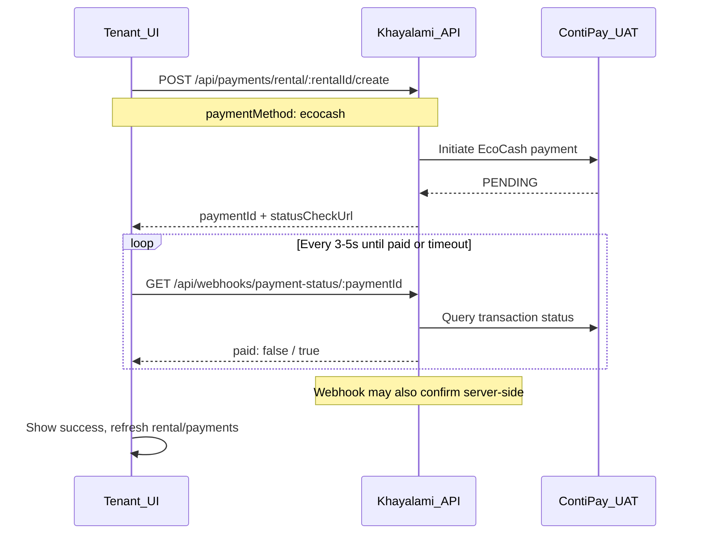

# Tenant Rent Payment (EcoCash) — Frontend Implementation Guide

This document is the **full API reference** for implementing **online rent payments** via **EcoCash** on the Khayalami portal and mobile app.

**Frontend action checklist:** see [FRONTEND_RENT_ECOCASH_REQUIREMENTS.md](./FRONTEND_RENT_ECOCASH_REQUIREMENTS.md) for a focused must-do guide.

**Applies to:** Tenant role only  
**Gateway (backend internal):** ContiPay UAT/live — frontend never sends `contipay` as `paymentMethod`  
**Tenant-facing method:** `ecocash`

Related: [ENDED_RENTALS_FRONTEND.md](./ENDED_RENTALS_FRONTEND.md) (disable pay on ended rentals), [CONTIPAY_INTEGRATION.md](./CONTIPAY_INTEGRATION.md) (gateway ops)

---

## User story

| ID | Story | Acceptance |
|----|--------|------------|
| R1 | As a **tenant** with an **active** rental, I want to **pay rent with EcoCash** so my landlord receives payment through Khayalami. | Pay button visible only when rental is active (`canPayRent === true`). |
| R2 | As a **tenant**, I want clear feedback while payment processes. | Loading state + poll until success or failure. |
| R3 | As a **tenant** on a **past/ended** rental, I must not pay rent. | Pay UI disabled; API returns 400 if called anyway. |

---

## End-to-end flow



**Important:** The frontend **never** calls `POST /api/webhooks/contipay`. That URL is for ContiPay → backend only. The frontend uses **`GET /api/webhooks/payment-status/:paymentId`** to poll.

---

## Prerequisites

1. Tenant is logged in (`Authorization: Bearer <token>`).
2. Tenant has an **active** rental (`GET /api/rentals` or tenant dashboard).
3. Rental has a **pending** rent installment (backend creates schedule when agreement completes).
4. For ended rentals, check `canPayRent === false` / `isReadOnlyHistory === true` — do not show pay form ([ENDED_RENTALS_FRONTEND.md](./ENDED_RENTALS_FRONTEND.md)).

---

## Step 1 — Get the rental ID

```
GET /api/rentals
GET /api/rentals?status=active
GET /api/tenant/dashboard
```

Use the active rental `_id` as `rentalId` in the pay endpoint.

Optional — show amount before pay:

```
GET /api/rentals/:rentalId/payments?status=pending
GET /api/rentals/:rentalId
```

The **first pending** installment is what the backend charges (may include **agreement fee on first rent only**, e.g. $1,530 = $1,500 rent + $30 fee).

---

## Step 2 — Initiate EcoCash rent payment

### Endpoint

```
POST /api/payments/rental/:rentalId/create
Authorization: Bearer <tenant_token>
Content-Type: application/json
```

**Base URL:** use your existing `VITE_API_URL` (e.g. `https://khayamanage.co.zw/api/backend`).

Full example:

```
POST https://khayamanage.co.zw/api/backend/api/payments/rental/6a422759da655860a1e897d8/create
```

---

### Request body

#### Minimum (recommended for current UAT/sandbox)

```json
{
  "paymentMethod": "ecocash",
  "paymentType": "rent",
  "amount": 500
}
```

`amount` is **required** — EcoCash charges exactly this value. Partial payments are allowed if `amount` ≤ installment balance due.

#### Full body (all supported fields)

```json
{
  "paymentMethod": "ecocash",
  "paymentType": "rent",
  "amount": 1530,
  "phone": "0771234567",
  "notes": "Rent payment",
  "email": "tenant@example.com",
  "firstName": "Nyasha",
  "lastName": "K"
}
```

### Field reference

| Field | Required | Description |
|-------|----------|-------------|
| `paymentMethod` | **Yes** | Must be **`"ecocash"`** for online rent. (Legacy alias `"contipay"` still accepted but do not use in new UI.) |
| `paymentType` | No | Default `"rent"`. |
| `amount` | **Yes** | Amount to charge via EcoCash. Must be **> 0** and **≤** next installment balance due. Partial payments supported. |
| `phone` | See below | EcoCash mobile number. |
| `notes` | No | Optional note stored on payment. |
| `email`, `firstName`, `lastName` | No | Passed to gateway customer profile; optional. |

\*There must be a pending or overdue rent installment; `amount` cannot exceed its balance.

---

### Phone number rules

| Environment | Frontend behaviour | Backend behaviour |
|-------------|-------------------|-------------------|
| **UAT / sandbox** (`CONTIPAY_ENVIRONMENT=dev`) | You **may** show a phone field for UX, but it is **ignored**. No validation error if omitted. | Always uses ContiPay test number **`0771234567`** (success simulation). |
| **Production** (`CONTIPAY_ENVIRONMENT=live`) | **Required.** Validate Zimbabwe format: `07XXXXXXXX` or `2637XXXXXXXX`. | Uses the tenant's submitted number for real EcoCash USSD. |

**Sandbox test numbers** (ContiPay docs — for QA reference only; backend forces success number in dev):

| Phone | Result |
|-------|--------|
| `0771234567` | Success |
| `0771234568` | Insufficient funds |
| `0771234569` | Timeout |

**UI suggestion for UAT:** Show a small banner: *"Test mode: payments use sandbox EcoCash simulation. No real charge."*

---

### Success response `201`

```json
{
  "success": true,
  "message": "EcoCash payment initiated (sandbox test mode). Poll status until confirmed.",
  "data": {
    "paymentId": "6a42275ada655860a1e897de",
    "reference": "RENT-6a1b1a191fa6f15a95872be8-1719654321000",
    "paymentMethod": "ecocash",
    "pollUrl": null,
    "instructions": "PENDING SUBSCRIBER VALIDATION",
    "statusCheckUrl": "/api/webhooks/payment-status/6a42275ada655860a1e897de",
    "gateway": "contipay",
    "testMode": true,
    "sandboxNote": "EcoCash sandbox number used; user phone ignored in UAT."
  }
}
```

| Field | Use |
|-------|-----|
| `paymentId` | Store for polling. |
| `statusCheckUrl` | Relative path — prepend `VITE_API_URL`. |
| `instructions` | Show in UI (e.g. "Check your phone…" in live; sandbox may auto-complete). |
| `testMode` | If `true`, show test banner; phone field optional. |

---

### Error responses

| HTTP | Message (examples) | Frontend action |
|------|-------------------|-----------------|
| `400` | `Online rent payment requires paymentMethod 'ecocash'` | Send `paymentMethod: "ecocash"`. |
| `400` | `Invalid payment amount. No pending rent installment found.` | No pending rent; refresh schedule or contact support. |
| `400` | `This rental is no longer active...` | Disable pay UI (ended rental). |
| `400` | Gateway / ContiPay error message | Show error toast; allow retry. |
| `404` | `Rental not found` | Invalid `rentalId` or wrong user. |
| `401` | Unauthorized | Re-login. |

---

## Step 3 — Poll payment status

### Endpoint

```
GET /api/webhooks/payment-status/:paymentId
Authorization: Bearer <tenant_token>
```

**Full URL example:**

```
GET https://khayamanage.co.zw/api/backend/api/webhooks/payment-status/6a42275ada655860a1e897de
```

Use `data.statusCheckUrl` from Step 2 — it is already the correct path after your API base.

### Poll response — still processing

While ContiPay confirms the EcoCash prompt, `data.paid` stays `false`. The top-level `data.status` may be:

| `data.status` | Meaning |
|---------------|---------|
| `pending` | Awaiting gateway confirmation |
| `processing` | Gateway payment in flight (DB row may show `overdue` on a scheduled installment — still poll) |

```json
{
  "success": true,
  "data": {
    "paid": false,
    "status": "processing",
    "payment": {
      "_id": "...",
      "status": "overdue",
      "amount": 1500,
      "gatewayReference": "RENT-...",
      "paymentType": "rent"
    },
    "gateway": "contipay"
  }
}
```

Keep polling until `paid === true` or a terminal status below.

### Poll response — completed

```json
{
  "success": true,
  "data": {
    "paid": true,
    "status": "completed",
    "payment": {
      "_id": "...",
      "status": "verified",
      "amount": 1530,
      "verifiedAt": "2026-06-29T08:10:00.000Z"
    },
    "gateway": "contipay"
  }
}
```

### Poll response — failed / expired

```json
{
  "success": true,
  "data": {
    "paid": false,
    "status": "cancelled",
    "payment": { "status": "cancelled", "rejectionReason": "..." }
  }
}
```

Statuses to **stop polling** (terminal):

| `data.status` | `data.paid` | UI |
|---------------|-------------|-----|
| `completed` | `true` | Success screen |
| `cancelled` | `false` | Failed — try again |
| `expired` | `false` | Timed out — try again |
| `rejected` | `false` | Failed |

### Polling rules

| Setting | Value |
|---------|--------|
| Interval | **3–5 seconds** |
| Frontend max duration | **2–3 minutes** (show “still processing” then let user retry) |
| Backend expiry | **`CONTIPAY_PAYMENT_EXPIRY_MINUTES`** (default **15 min**) — poll returns `status: "expired"` after this |
| Stop when | `paid === true` OR terminal status above |
| On success | Refresh rental detail, payment list, tenant dashboard |

---

## Reference implementation (TypeScript)

```typescript
const API_BASE = import.meta.env.VITE_API_URL; // e.g. https://khayamanage.co.zw/api/backend

type PayRentParams = {
  rentalId: string;
  token: string;
  phone?: string;       // required in production UI
  amount: number;       // required — amount tenant pays via EcoCash
  notes?: string;
};

export async function payRentEcoCash({ rentalId, token, phone, amount, notes }: PayRentParams) {
  const res = await fetch(`${API_BASE}/api/payments/rental/${rentalId}/create`, {
    method: "POST",
    headers: {
      Authorization: `Bearer ${token}`,
      "Content-Type": "application/json",
    },
    body: JSON.stringify({
      paymentMethod: "ecocash",
      paymentType: "rent",
      amount,
      ...(phone && { phone }),
      ...(notes && { notes }),
    }),
  });

  const json = await res.json();
  if (!res.ok || !json.success) {
    throw new Error(json.message || "Payment initiation failed");
  }
  return json.data as {
    paymentId: string;
    statusCheckUrl: string;
    instructions?: string;
    testMode?: boolean;
  };
}

export async function pollPaymentStatus(paymentId: string, token: string) {
  const res = await fetch(`${API_BASE}/api/webhooks/payment-status/${paymentId}`, {
    headers: { Authorization: `Bearer ${token}` },
  });
  const json = await res.json();
  return json.data as { paid: boolean; status: string; payment?: unknown };
}

export async function payRentAndWait(params: PayRentParams, onProgress?: (status: string) => void) {
  const initiated = await payRentEcoCash(params);
  const paymentId = initiated.paymentId;
  const deadline = Date.now() + 3 * 60 * 1000;

  while (Date.now() < deadline) {
    const status = await pollPaymentStatus(paymentId, params.token);
    onProgress?.(status.status);

    if (status.paid) return { success: true as const, paymentId, payment: status.payment };
    if (["cancelled", "expired", "rejected", "failed"].includes(status.status)) {
      return { success: false as const, paymentId, status: status.status };
    }
    // "pending" and "processing" — keep polling

    await new Promise((r) => setTimeout(r, 4000));
  }

  return { success: false as const, paymentId, status: "timeout" };
}
```

---

## UI checklist

### Pay rent screen

- [ ] Only show for **active** rental (`canPayRent === true`)
- [ ] Payment method label: **EcoCash** (not "ContiPay")
- [ ] Phone input: **required in production**, optional in UAT (hide or disable with test banner if `testMode` in response)
- [ ] Display **amount due** from pending payment or rental dashboard (first installment may be higher due to agreement fee)
- [ ] Primary CTA: "Pay with EcoCash"
- [ ] On submit: disable button → call create → show spinner with `instructions`
- [ ] Poll `statusCheckUrl` until `paid` or failure
- [ ] Success: receipt/summary + refresh lists
- [ ] Failure: error message + retry

### Do not

- [ ] Call `POST /api/webhooks/contipay` from the browser
- [ ] Use `paymentMethod: "contipay"` in new UI (use `ecocash`)
- [ ] Enable pay form on **ended** rentals
- [ ] Assume payment is instant without polling

---

## External / offline rent (out of scope for this doc)

Bank transfer or cash with proof upload uses a **different** flow — **not** `ecocash`:

```json
{
  "paymentMethod": "bank_transfer",
  "amount": 1500,
  "proofOfPayment": "https://firebase.../receipt.jpg"
}
```

→ Creates a **payment request** for admin approval (no polling).

---

## Quick test (current sandbox)

1. Log in as tenant with active rental.
2. `POST` with body `{ "paymentMethod": "ecocash", "paymentType": "rent" }`.
3. Poll `GET /api/webhooks/payment-status/:paymentId` every 4s.
4. Expect `paid: true` within ~30s in UAT (sandbox auto-completes for test number).

---

## Summary for frontend agent

1. **`paymentMethod` must be `"ecocash"`** — not `contipay`.
2. **`phone`** — collect in production; **optional in UAT** (backend uses `0771234567`).
3. **`amount`** — **required**; EcoCash charges exactly what the tenant sends.
4. **Poll** `GET /api/webhooks/payment-status/:paymentId` until `data.paid === true`.
5. **Never** call the ContiPay webhook from the client.
6. **Disable** pay UI when rental is not active.
